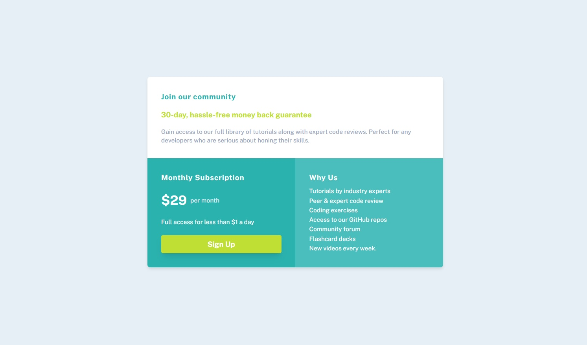

# Single-price-grid-component
# Frontend Mentor - Single price grid component solution

This is a solution to the [Single price grid component challenge on Frontend Mentor](https://www.frontendmentor.io/challenges/single-price-grid-component-5ce41129d0ff452fec5abbbc). Frontend Mentor challenges help you improve your coding skills by building realistic projects. 

## Table of contents

- [Overview](#overview)
  - [The challenge](#the-challenge)
  - [Screenshot](#screenshot)
  - [Links](#links)

  - [Built with](#built-with)
  - [What I learned](#what-i-learned)
  - [Continued development](#continued-development)
  - [Useful resources](#useful-resources)
- [Author](#author)
- [Acknowledgments](#acknowledgments)

**Note: Delete this note and update the table of contents based on what sections you keep.**

## Overview

### The challenge

Users should be able to:

- View the optimal layout for the component depending on their device's screen size
- See a hover state on desktop for the Sign Up call-to-action

### Screenshot

### Links

- Solution URL: [Add solution URL here](https://your-solution-url.com)
- Live Site URL: [Add live site URL here](https://your-live-site-url.com)

### Built with

- Semantic HTML5 markup
- CSS custom properties
- TailwindCSS
- Mobile-first workflow

### What I learned

I learned how to use media queries to manipualate a grid container to fit the design. 

### Continued development

I would like to focus on more efficient ways to manipulate containers while having responsive web design(RWD)

### Useful resources

Tailwindcss/[https://tailwindcss.com/] I used the documentation to look for the best ways to present the component.

## Author

- Frontend Mentor - [@quenyoni](https://www.frontendmentor.io/profile/quenyoni)
- Twitter - [@quenyoni](https://twitter.com/quenyoni)

## Acknowledgments

I want to thank FrontEndMentor for rolling out this free project.I've learned so much.
